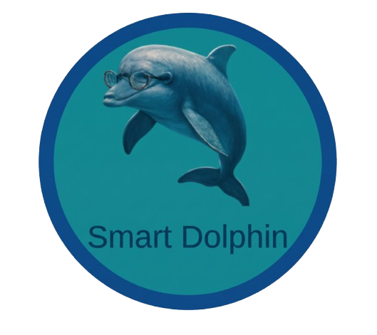

# 🐬 Smart Study Companion

**Smart Study Companion**, sınav hazırlık sürecindeki öğrencilerin odaklanma sürelerini optimize etmek, günlük çalışma hedeflerini takip etmek ve ders notlarına hızla erişmelerini sağlamak amacıyla geliştirilmiş modern bir mobil verimlilik uygulamasıdır.

<p align="center">
  
</p>

---

## ✨ Özellikler

* ⏱️ **Pomodoro Sayacı:** 25 dakikalık odaklanma ve mola periyotlarıyla verimli ders çalışma oturumları.
* 🎯 **Günlük Hedefler:** Tamamlanan görevleri işaretleme, anlık ilerleme çubuğu ve pratik hedef ekleme/silme.
* 📝 **Çalışma Notları:** Ders bazlı formüller, konu özetleri ve sınav taktikleri için hızlı erişim alanı.
* 🔍 **Keşfet & Test Havuzu:** TYT ve AYT odaklı deneme/test kategorizasyonu.
* 🎨 **Modern Arayüz:** Gece çalışma oturumlarında gözü yormayan yüksek kontrastlı koyu mod tasarımı.

---

## 🛠️ Teknolojiler

* **Çatı (Framework):** React Native, Expo
* **Yönlendirme (Routing):** Expo Router
* **Programlama Dili:** TypeScript
* **Bileşen & Stil:** React Native StyleSheet, Flexbox
* **Bulut / Veri:** Firebase
* **Dağıtım / Yapılandırma:** EAS (Expo Application Services)

---

## 📂 Proje Yapısı

```text
├── app/
│   ├── (tabs)/
│   │   ├── _layout.tsx      # Sekme çubuğu ve gezinme düzeni
│   │   ├── index.tsx        # Ana vitrin & çalışma arkadaşı paneli
│   │   ├── pomodoro.tsx     # Pomodoro odaklanma ekranı
│   │   ├── hedefler.tsx     # Günlük görevler ve takip listesi
│   │   ├── notlarim.tsx     # Çalışma notları arayüzü
│   │   └── keşfet.tsx       # Keşfet & soru arama
│   ├── _layout.tsx          # Kök yığın (stack) yönlendirmesi
│   └── modal.tsx            # Bilgilendirme modülü
├── assets/                  # Görsel varlıklar ve ikonlar
├── config/
│   └── firebase.ts          # Firebase servis yapılandırması
├── app.json                 # Expo proje ayarları
└── eas.json                 # EAS build konfigürasyonu
